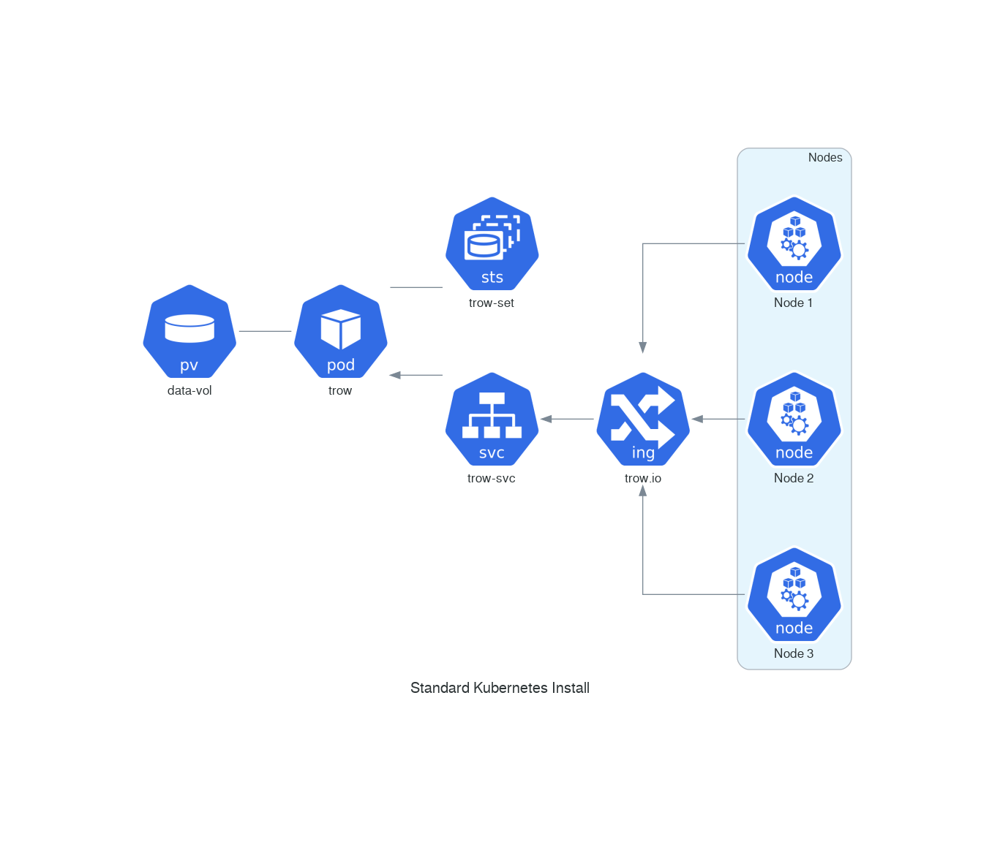
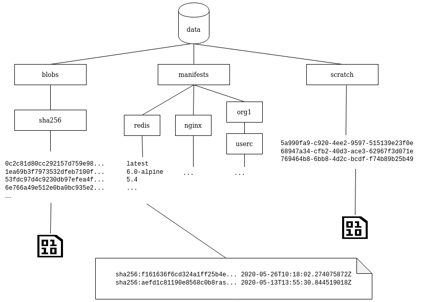

# Trow Architecture

Trow started with a front-end and a backend communicating via gRPC,
gRPC was removed to simplify the structure, but you will still find that the registry
module is very distinct from the rest of the trow crate.

Note:

 1. All interaction with clients (normally the Docker Daemon, but also podman, CI/CD tools etc) is
    currently via a RESTful (ish) API interface. The interface is defined by the OCI Distribution
    spec, although Trow adds a few features of its own.

 2. Trow saves container image data to file. Currently, we don't have any options to use different
    storage like S3. This still allows a considerable deal of flexibility as it can be backed by
    multiple volume types, but at the same time we avoid the complexity of handling the error states
    of remote storage such as S3.

Trow is implemented in [Rust](https://www.rust-lang.org/).

## Typical Kubernetes Deployment

The helm install will result in a deployment like this:

Trow data is backed to a volume, for example Google Persistent Disk. A
[StatefulSet](https://kubernetes.io/docs/concepts/workloads/controllers/statefulset/) rather than a
Deployment is used. This is required to handle updating Trow and reattaching the volume correctly.
All clients, including Kubernetes Nodes themselves connect to the registry via the Ingress. This

## Upload/Download Tracking and File Layout

This diagram shows how files are laid out in the data directory that represents the state of the
registry:

To understand how this is used, consider the process of uploading a new image:

 - The client begins by uploading all the layers that are not present in the registry. These uploads
   are given a UUID and tracked in the `scratch` directory.
 - When a layer upload completes, the digest is checked and it is copied to the `blobs` directory
   before being removed from `scratch`. The digest is used as the file name. All digests at the
   moment are SHA256 hashes of the content, but note that other algorithms could be used in the
   future - hence the existence of the `sha256` parent directory.
 - Once the layers are uploaded, the manifest is uploaded in the same manner.
 - The manifest is then checked by Trow to make sure all the layers are available and match their
   digests, before a file named after the tag is copied to a directory under manifests e.g.
   `manifests/redis/latest` or `manifests/containersol/trow/default`. The contents of the file are
   the digest of the manifest and the current date. The manifest itself can then be found by looking
   up the digest in the `blobs` directory. If the tag file already exists, the new digest and date
   are written as the first line in the file. Previous entries are kept for auditing and the "tag
   history" endpoint.

So this means:

 - Files in the `blobs` directory represent not just image layers, but also manifests and config
   data referred to from manifests.
 - The files in scratch _are not_ digests. They are UUIDs used for temporary tracking of uploads.
 - The manifests folder more or less indexes the blobs; it lets us find the data associated with a
   named tag.
 - Doing a "GC sweep" to get rid of unused blobs means going through the manifests directory and
   creating an inventory of digests referred to by the manifests. Any blobs that aren't on the final
   list can be safely deleted without breaking an image. The current plan is to avoid doing this in
   a "pause-the-world" GC pass and instead continually ensure the file system is synchronised.
